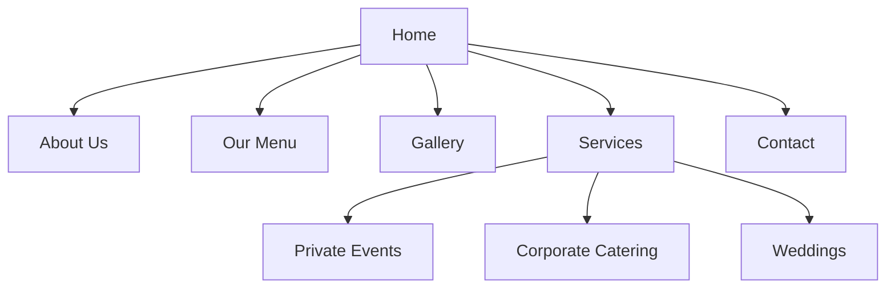
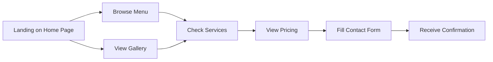

# Paella Party NJ Website Architecture Plan

## 1. Site Structure

### Pages and Navigation

#### Primary Pages:

1. **Home**
   - Hero section with captivating paella images and tagline
   - Brief introduction to Paella Party NJ
   - Featured testimonials
   - Call-to-action for booking
   - Instagram feed preview

2. **About Us**
   - Chef Diego and Maria's story
   - Spanish heritage and 40 years of experience
   - Authentic cooking methods and ingredients
   - Business values (authenticity, family tradition, memorable experiences)
   - Team photos and bios

3. **Our Menu**
   - Paella varieties with descriptions and pricing
   - Tapas and additional offerings
   - Pricing structure
   - Special dietary accommodations
   - Beverage options

4. **Gallery**
   - Event photos organized by event type
   - Cooking process photos
   - Food presentation images
   - Video content

5. **Services**
   - Overview of catering services
   - Sub-sections for different event types:
     - Private Events
     - Corporate Catering
     - Weddings
   - Equipment and setup information
   - Service area (NJ locations covered)

6. **Contact**
   - Contact form
   - Direct contact information
   - Service area map
   - FAQ section
   - Booking process explanation

### Navigation Structure:

- **Primary Navigation**: Horizontal menu at the top with the 6 main sections
- **Footer Navigation**: Simplified menu with additional links to Privacy Policy, Terms of Service
- **Mobile Navigation**: Hamburger menu expanding to full-screen navigation
- **Call-to-Action**: "Book Now" button persistent across all pages

## 2. Design Direction

### Color Scheme

Based on Mediterranean and Spanish influences, with colors that evoke paella ingredients and Spanish culture:

- **Primary Colors**:
  - Saffron Yellow (#F5B700) - Representing the key paella ingredient
  - Terracotta Red (#C64600) - Reminiscent of Spanish clay cookware
  - Olive Green (#3A5311) - Representing Mediterranean ingredients

- **Secondary Colors**:
  - Navy Blue (#003459) - Representing the Mediterranean Sea
  - Cream (#F5F5DC) - For background and negative space
  - Charcoal (#333333) - For text and contrast

### Typography

- **Headings**: "Playfair Display" - Elegant serif font with Spanish character
- **Body Text**: "Open Sans" - Clean, readable sans-serif
- **Accent Text**: "Courgette" - Script font for quotes and special highlights

### Layout Approach

- **Overall Style**: Clean, modern layout with Mediterranean warmth
- **Grid System**: 12-column responsive grid
- **Visual Hierarchy**: Focus on food imagery with supporting text
- **White Space**: Generous spacing to create an upscale, uncluttered feel
- **Imagery**: Large, high-quality food photography as focal points
- **Decorative Elements**: Subtle Spanish-inspired patterns and textures

### Visual Elements

- **Hero Sections**: Full-width image banners with overlay text
- **Cards**: For menu items and service offerings
- **Image Galleries**: Masonry-style photo galleries
- **Iconography**: Custom icons with Mediterranean/Spanish influence
- **Buttons**: Rounded corners with subtle hover effects
- **Dividers**: Decorative section dividers with Spanish-inspired patterns

## 3. Content Organization Strategy

### Home Page Content Priority

1. Hero image/slider with tagline and CTA
2. Brief introduction to Paella Party NJ
3. Featured paella varieties (visual cards)
4. Testimonials from satisfied customers
5. Instagram feed/gallery preview
6. Contact/booking CTA

### Content Modules

- **Testimonial Module**: Customer quotes with event photos
- **Menu Card Module**: Visual representation of menu items with prices
- **Service Highlight Module**: Icon + text explaining service features
- **Gallery Module**: Filterable photo gallery
- **Chef Story Module**: Biography with timeline elements
- **Contact Form Module**: Styled form with validation

### Content Types

- **Text Content**: 
  - Descriptive copy about services and food
  - Chef's story and background
  - Menu descriptions
  - Service explanations

- **Image Content**:
  - Food photography (paella varieties, tapas)
  - Event photography (different venues and setups)
  - Chef and team photos
  - Cooking process images

- **Video Content**:
  - Cooking demonstrations
  - Event highlights
  - Customer testimonials

## 4. Key User Flows

### Primary User Flow: Potential Customer Booking Process

### Secondary User Flows:

1. **Learning About the Business**:
   - Home → About Us → Gallery → Contact

2. **Menu Exploration**:
   - Home → Menu → Services → Contact

3. **Event Planning**:
   - Home → Services → Gallery → Menu → Contact

## 5. Responsive Design Considerations

### Breakpoints

- **Mobile**: 320px - 767px
- **Tablet**: 768px - 1023px
- **Desktop**: 1024px - 1439px
- **Large Desktop**: 1440px+

### Mobile-Specific Adaptations

- **Navigation**: Hamburger menu with full-screen overlay
- **Images**: Optimized versions for faster loading
- **Layout**: Single column with stacked elements
- **Typography**: Increased font sizes for readability
- **Gallery**: Simplified view with reduced columns
- **Contact Form**: Simplified with full-width inputs

### Tablet-Specific Adaptations

- **Navigation**: Condensed horizontal menu or hamburger depending on space
- **Layout**: 2-column grid for certain sections
- **Gallery**: 2-3 column masonry layout
- **Menu Display**: Card-based layout with 2 columns

### Performance Considerations

- **Image Optimization**: Compressed images with lazy loading
- **Critical CSS**: Inline critical styles for faster rendering
- **Font Loading**: Web font optimization with fallbacks
- **Component Loading**: Progressive loading of non-critical components

## 6. Technical Implementation Recommendations

### Recommended Technologies

- **Frontend Framework**: HTML5, CSS3, JavaScript (vanilla or lightweight framework)
- **CSS Approach**: CSS Grid and Flexbox for layouts
- **Animation**: Subtle CSS animations for enhanced UX
- **Form Handling**: JavaScript form validation with email service integration
- **Gallery**: Lightweight JavaScript gallery plugin
- **Maps**: Google Maps API for location display

### Development Priorities

1. Mobile-first responsive design
2. Optimized image loading for performance
3. Accessible navigation and content structure
4. SEO-friendly HTML structure
5. Contact form with validation and submission handling

### Future Enhancement Possibilities

- Online booking system integration
- Customer review submission
- Event calendar
- Blog section for recipes and event highlights
- Social media integration beyond basic sharing